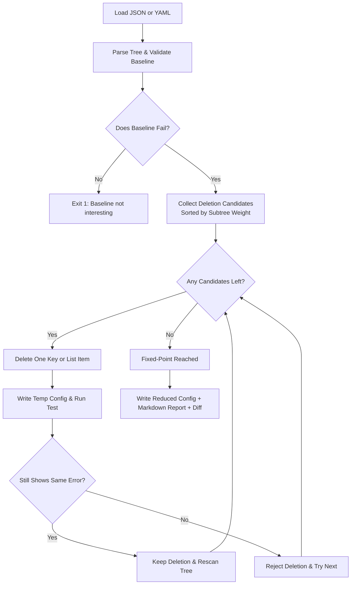

```
 ███╗   ███╗██╗███╗   ██╗██████╗ ███████╗██████╗ ██████╗  ██████╗ 
 ████╗ ████║██║████╗  ██║██╔══██╗██╔════╝██╔══██╗██╔══██╗██╔═══██╗
 ██╔████╔██║██║██╔██╗ ██║██████╔╝█████╗  ██████╔╝██████╔╝██║   ██║
 ██║╚██╔╝██║██║██║╚██╗██║██╔══██╗██╔══╝  ██╔═══╝ ██╔══██╗██║   ██║
 ██║ ╚═╝ ██║██║██║ ╚████║██║  ██║███████╗██║     ██║  ██║╚██████╔╝
 ╚═╝     ╚═╝╚═╝╚═╝  ╚═══╝╚═╝  ╚═╝╚══════╝╚═╝     ╚═╝  ╚═╝ ╚═════╝ 
```

# minrepro

> **Structure-aware JSON/YAML config shrinker:** Find the smallest configuration snippet that still reproduces your bug.

[](https://github.com/dhrrishitvdeka/minrepro/actions/workflows/ci.yml)
[](LICENSE)
[](https://www.python.org/downloads/)

---

## ⚡ What is minrepro? (In 15 Seconds)

When debugging huge Kubernetes manifests, Docker Compose files, CI workflows, or app configs, finding the exact offending line by hand is tedious and slow.

**`minrepro`** automates this delta debugging process:
1. Parses your configuration tree (JSON or YAML).
2. Runs your test command against the baseline to capture the exact failure.
3. Greedily removes unused keys and array items (largest subtrees first).
4. Keeps only deletions where your test **still fails with that exact same error**.
5. Outputs a minimal, valid config and a Markdown report with a unified diff!

### 🔍 Before vs. After Example

**Original (100+ lines):**
```yaml
services:
  frontend:
    image: frontend:latest
    ports:
      - "3000:3000"
  backend:
    image: backend:latest
    environment:
      DATABASE_URL: postgres://db
      CACHE_URL: redis://cache
      BAD_OPTION: true
    volumes:
      - ./data:/data
```

**After `minrepro` (Only what reproduces the failure):**
```yaml
services:
  backend:
    environment:
      BAD_OPTION: true
```

---

## 🚀 Quick Start

### 1. Install

```bash
pip install "git+https://github.com/dhrrishitvdeka/minrepro.git@v0.2.1"
```

Verify installation:
```bash
minrepro --version
```

### 2. Run on a Broken File

```bash
minrepro broken.yaml --test "my-tool --config {}" --error-contains "BAD_OPTION"
```

> **Note:** The `{}` placeholder is automatically replaced by the path to each test candidate.

---

## 📋 Common Real-World Recipes

### 🐳 Docker Compose
Shrink a broken compose file that fails validation:
```bash
minrepro compose.yaml \
  --test "docker compose -f {} config" \
  --error-contains "service 'db' has invalid configuration"
```

### ☸️ Kubernetes Manifests
Isolate an invalid field in a large manifest using `kubectl` dry-run:
```bash
minrepro deployment.yaml \
  --test "kubectl apply --dry-run=server -f {}" \
  --error-contains "unknown field"
```

### 🤖 GitHub Actions Workflows
Isolate an invalid step or action in a `.github/workflows/*.yml` file using `actionlint`:
```bash
minrepro .github/workflows/ci.yml \
  --test "actionlint {}" \
  --error-contains "unexpected key"
```

### 📦 App Settings & JSON Payloads
Shrink an API request body or settings file:
```bash
minrepro payload.json \
  --test "python -m myapp.validate --input {}" \
  --diff
```

### ⚡ Direct In-Place Edit with Diff
Overwrite the file directly in place and display a colored terminal diff:
```bash
minrepro broken.yaml -t "pytest tests/test_config.py" --inplace --diff
```

---

## 🎛️ CLI Reference

```text
minrepro INPUT --test "CMD with {}" [options]
```

### Options Overview

| Flag | Shorthand | Description |
| :--- | :--- | :--- |
| `INPUT` | | Path to failing JSON or YAML file |
| `--test CMD` | `-t CMD` | Command to run (`{}` is replaced with the candidate path) |
| `--output PATH` | `-o PATH` | Output path for reduced config (default: `<name>.min.<ext>`) |
| `--inplace` | `-i` | Overwrite the input file directly with the reduced config |
| `--diff` | `-d` | Print a syntax-highlighted diff of all removed keys/lines |
| `--check` | | Test whether the baseline fails without shrinking (exit 0 if fails, 1 if ok) |
| `--env KEY=VAL` | `-e KEY=VAL` | Set environment variable for the test subprocess (repeatable) |
| `--report PATH` | `-r PATH` | Path to Markdown report (default: `<name>.minrepro.md`) |
| `--no-report` | | Do not generate a Markdown report |
| `--stdout` | | Print the reduced config directly to stdout |
| `--no-output` | | Do not write a reduced config file to disk |
| `--format json\|yaml` | | Force format (default: auto-detected) |
| `--exit-code N` | | Require an exact exit code (default: any non-zero code) |
| `--error-contains TEXT`| | Require this substring in command output (stdout + stderr) |
| `--error-regex PATTERN`| | Require this regex to match command output |
| `--timeout SEC` | | Per-run timeout in seconds (default: `60`; `0` for none) |
| `--max-steps N` | | Stop after N deletion attempts (for debugging) |
| `--quiet` | `-q` | Suppress progress output on stderr |
| `--version` | | Show version and exit |

### Exit Codes

| Code | Meaning |
| :---: | :--- |
| **`0`** | **Success:** Config reduced (or baseline is interesting when using `--check`). |
| **`1`** | **Baseline Not Interesting:** The original config does not trigger the specified failure. |
| **`2`** | **Error:** Invalid command-line arguments, parse failure, or configuration error. |

---

## 🔍 How It Works



### Same-Failure Safety Guarantee
`minrepro` ensures your reduction never "drifts" into a different error:
- **Predicate Check:** Must match `--exit-code`, `--error-contains`, and `--error-regex` if specified.
- **Signature Anchoring:** Distinguishes distinctive failure tokens from generic noise (e.g. emptying a file into a syntax error is automatically rejected).

---

## 🐍 Python Library API

Use `minrepro` programmatically in Python scripts, test harnesses, or CI pipelines:

```python
from pathlib import Path
from minrepro import reduce_file, reduce_data, load

# 1. Reduce a file directly
result = reduce_file(
    "broken.yaml",
    command="python -m myapp.check --config {}",
    error_contains="BAD_OPTION",
)
print("Reduced YAML:")
print(result.reduced_text)

# 2. Reduce in-memory data
data, fmt, original_text = load(Path("broken.yaml"))
result = reduce_data(
    data,
    command="python -m myapp.check --config {}",
    fmt=fmt,
    original_text=original_text,
    error_contains="BAD_OPTION",
)
print(f"Removed {len(result.events)} items in {result.duration_seconds:.2f}s")
```

---

## 💻 Platforms & Cross-Platform Details

`minrepro` is written in pure Python with zero OS-specific binaries:

| Area | Windows Behavior | POSIX (Linux / macOS) Behavior |
| :--- | :--- | :--- |
| **Shell** | `cmd.exe` via CreateProcess (`shell=True`) | `/bin/sh` / `bash` |
| **Quoting** | Double quotes with `%` escaping (`%%`) | Single quotes via `shlex.quote` |
| **Temp Files** | Closed before subprocess access (no lock conflicts) | Standard unlinking |
| **Line Endings** | Normalized to `\n` (UTF-8, no CRLF git noise) | Standard `\n` |
| **Process Tree** | `taskkill /F /T` on timeout | `os.killpg(SIGKILL)` on timeout |

---

## 🛠️ Development & Contributing

```bash
# Clone and setup environment
git clone https://github.com/dhrrishitvdeka/minrepro.git
cd minrepro

# Install in editable mode with dev dependencies
pip install -e ".[dev]"

# Run test suite
pytest
```

---

## 📄 License

This project is licensed under the [MIT License](LICENSE).
