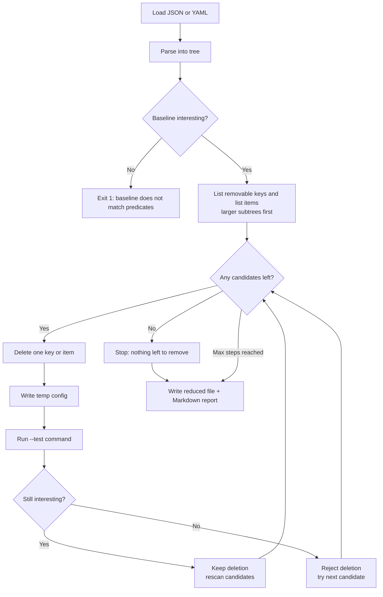

# minrepro

Shrink a failing JSON or YAML configuration to the smallest structure that still fails.

Long Kubernetes manifests, Compose files, CI configs, and app settings often hide one bad key among hundreds of lines. Deleting sections by hand is slow. `minrepro` removes mapping keys and list items automatically, keeps only changes that still reproduce the failure, and always leaves valid JSON or YAML.

```bash
minrepro broken.yaml \
  --test "kubectl apply --dry-run=server -f {}" \
  --error-contains "unknown field"
```

The name means **minimal reproduction**: a small config you can attach to a bug report or regression test.

## Requirements

- Python 3.10 or newer
- Dependencies: `PyYAML`, `rich` (installed with the package)
- **Native on Windows and Linux** (also macOS). Pure Python; no OS-specific binaries.

## Platforms (Windows and Linux)

| Area | Behavior |
| --- | --- |
| CLI | `minrepro` and `python -m minrepro` on Windows (cmd/PowerShell) and Linux (bash/sh) |
| Paths | Absolute paths; spaces in directories are quoted for the host shell |
| Oracle | `shell=True` uses `cmd.exe` on Windows and `/bin/sh` on Linux |
| Temp files | Closed before re-open (Windows-safe); UTF-8 bytes with no CRLF rewriting |
| Config I/O | Read UTF-8 (BOM-tolerant); write UTF-8 with LF newlines |
| CI | GitHub Actions matrix: `windows-latest`, `ubuntu-latest`, `macos-latest` |

Example on Windows (cmd or PowerShell):

```text
minrepro examples\broken.yaml --test "py examples\oracle_bad_option.py {}" --error-contains BAD_OPTION
```

Example on Linux:

```bash
minrepro examples/broken.yaml \
  --test "python3 examples/oracle_bad_option.py {}" \
  --error-contains BAD_OPTION
```

Prefer `python` / `python3` / `py` from your install; the `{}` path is substituted and quoted automatically.

## Install

Clone and install (recommended while the project is young):

```bash
git clone https://github.com/dhrrishitvdeka/minrepro.git
cd minrepro
pip install -e .
# with tests:
pip install -e ".[dev]"
```

From a release tag:

```bash
pip install "git+https://github.com/dhrrishitvdeka/minrepro.git@v0.1.0"
```

```bash
minrepro --version
# or
python -m minrepro --version
```

GitHub Releases (source archives and built wheels, when published):  
https://github.com/dhrrishitvdeka/minrepro/releases

## Quick start

This repository includes a sample config and a small Python oracle that fails only when `BAD_OPTION` is present:

```bash
minrepro examples/broken.yaml \
  --test "python examples/oracle_bad_option.py {}" \
  --error-contains BAD_OPTION
```

On Windows, if `python` is not on `PATH`, use `py`:

```text
minrepro examples/broken.yaml --test "py examples/oracle_bad_option.py {}" --error-contains BAD_OPTION
```

**Input** (`examples/broken.yaml`):

```yaml
services:
  frontend:
    image: frontend:latest
    ports:
      - "3000:3000"
  backend:
    image: backend:latest
    environment:
      DATABASE_URL: postgres://db
      CACHE_URL: redis://cache
      BAD_OPTION: true
    volumes:
      - ./data:/data
```

**Reduced output** (default path: `examples/broken.min.yaml`):

```yaml
services:
  backend:
    environment:
      BAD_OPTION: true
```

By default a Markdown report is also written to `examples/broken.minrepro.md`. Use `--no-report` to skip it.

JSON works the same way:

```bash
minrepro examples/broken.json \
  --test "python examples/oracle_bad_option.py {}" \
  --error-contains BAD_OPTION
```

## How it works



In short: parse, prove the original fails, greedily drop structure while the oracle still fails, then write the reduced config and report.

## CLI reference

```text
minrepro INPUT --test "CMD with {}" [options]
```

| Flag | Description |
| --- | --- |
| `INPUT` | Path to a failing JSON or YAML file |
| `--test`, `-t` | Shell command; the first `{}` is replaced by a quoted path to the candidate config |
| `--output`, `-o` | Reduced config path (default: `<stem>.min.<ext>` next to the input) |
| `--report`, `-r` | Markdown report path (default: `<stem>.minrepro.md`) |
| `--no-report` | Do not write a Markdown report |
| `--no-output` | Do not write a reduced config file |
| `--stdout` | Print reduced config to stdout |
| `--format json\|yaml` | Force format (default: detect from extension or content) |
| `--exit-code N` | Require this exact exit code (default: any non-zero) |
| `--error-contains TEXT` | Require this substring in combined stdout and stderr |
| `--error-regex PATTERN` | Require this regex to match combined stdout and stderr |
| `--timeout SEC` | Per-run timeout in seconds (default `60`; `0` means no timeout) |
| `--max-steps N` | Stop after N deletion attempts (for debugging) |
| `--quiet`, `-q` | Less progress on stderr |
| `--version` | Print version and exit |

### Exit codes

| Code | Meaning |
| ---: | --- |
| `0` | Shrink finished (baseline was interesting) |
| `1` | Baseline not interesting under the given predicates |
| `2` | Usage, parse, or configuration error |

### Predicates

A candidate is **interesting** (failure still present) when all of these hold:

1. **Exit code:** matches `--exit-code N` if set; otherwise any non-zero exit.
2. **Message (optional):** if `--error-contains` is set, that substring appears in stdout+stderr.
3. **Message (optional):** if `--error-regex` is set, the pattern matches stdout+stderr.

Timeouts are never treated as interesting. Exit code `0` under the default rules is not interesting.

The original input is checked first. If it is not interesting, `minrepro` exits with code `1` and does not treat a reduced file as success.

## Scope (v0.1)

### Removes

- Mapping keys at any nesting depth
- Sequence (list) items at any nesting depth

Each trial rewrites a complete, parseable document and re-runs `--test`.

### Does not support

- TOML or XML
- Optional scalar nulling, type mutation, or value fuzzing
- Multi-document YAML streams or CRD-specific logic
- YAML anchors, aliases, or merge keys
- Comment-preserving round-trips
- Guaranteed 1-minimal ddmin (uses multi-pass greedy structural deletion)

### JSON-compatible configs only

After parse, the tree must be JSON-compatible:

| Accepted | Rejected |
| --- | --- |
| Mappings / objects | Multi-document YAML streams (`---` separated) |
| Sequences / arrays | YAML anchors, aliases, merge keys |
| string, number, bool, null | YAML date / datetime scalars |
| Nested combinations of the above | `!!binary`, sets, custom or Python tags |

Kubernetes, Compose, and CI files that are map/list/scalar shaped usually work. If parse fails with `unsupported value type`, quote timestamps as strings or remove non-JSON constructs first.

Oracle stdout and stderr are decoded as UTF-8 with replacement characters, so tools that emit mixed encodings can still match `--error-contains` and `--error-regex` on readable text.

## Library usage

```python
from pathlib import Path
from minrepro.oracle import Oracle, OracleConfig
from minrepro.parse import load
from minrepro.shrink import Shrinker

data, fmt, text = load(Path("broken.yaml"))
oracle = Oracle(
    OracleConfig(
        command="my-tool --config {}",
        error_contains="boom",
    )
)
result = Shrinker(oracle, fmt, suffix=".yaml").shrink(data, text)
print(result.reduced_text)
```

## Development

```bash
pip install -e ".[dev]"
pytest
```

See [CONTRIBUTING.md](CONTRIBUTING.md), [CHANGELOG.md](CHANGELOG.md), and [RELEASING.md](RELEASING.md).

## Releases and tags

| Item | Value |
| --- | --- |
| Package / CLI name | `minrepro` |
| GitHub repository name | **minrepro** |
| Current version | `0.1.0` |
| Git tag | `v0.1.0` |

Pushing an annotated tag `v*` runs CI tests, builds sdist/wheel, and creates a GitHub Release (see `.github/workflows/release.yml`).

## License

[MIT](LICENSE)
